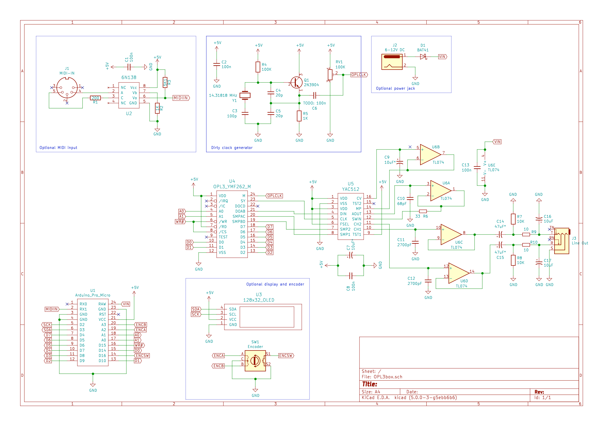

# OPL3box

This is about controlling an old OPL3 chip as a regular synth via MIDI. Work in progress.

You need to have [a21](https://github.com/aleh/a21) library installed in your Arduino environment.
Sketch > Include Library > Manage Libraries

## Schematics

See `kicad` folder for the most up-to-date version. Here is one as a PNG:

## PCB

See `kicad` folder.
